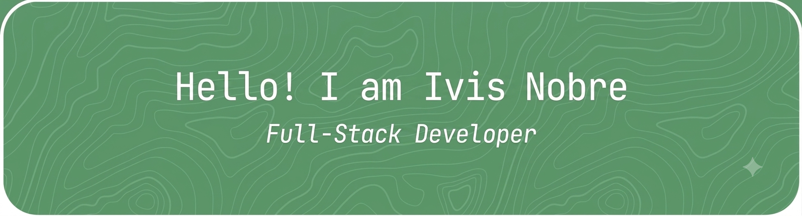

## :mortar_board: Academic background
- Mecatronics Técnico from IFRN (2019)
- Bachelor's degree in Information Technology from UFRN (Loading...)

## :computer: Technologies
**Languages:**

**Frameworks & Libraries:**

**DevOps & tools:**

## :octocat: Github

